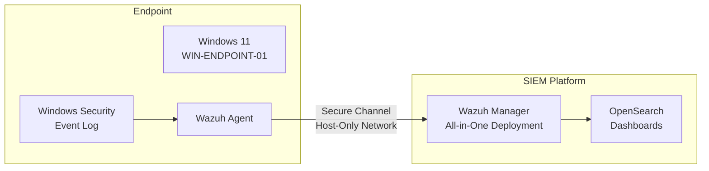
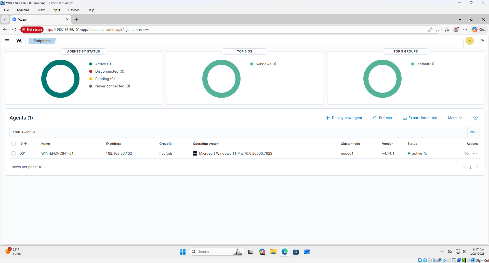
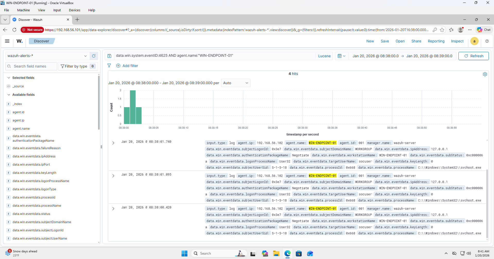
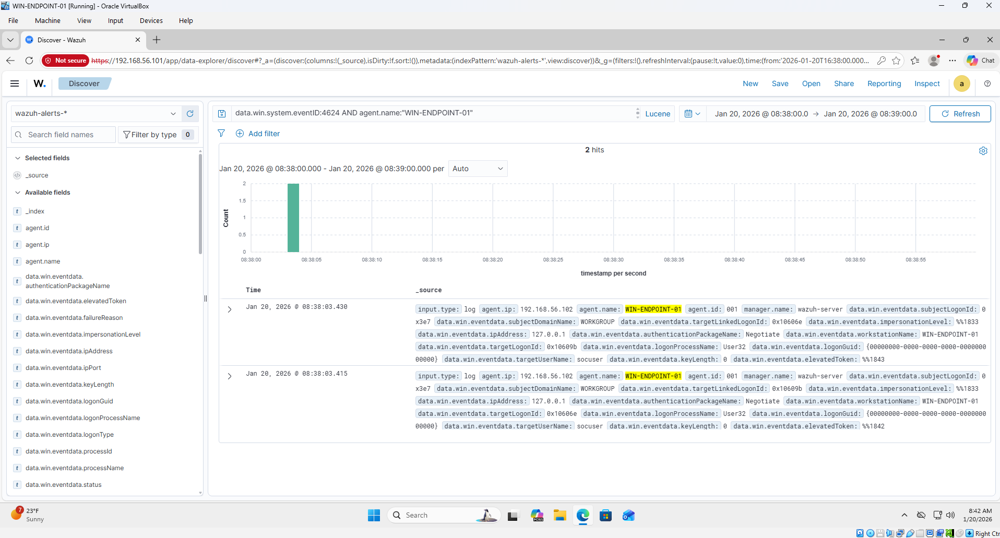
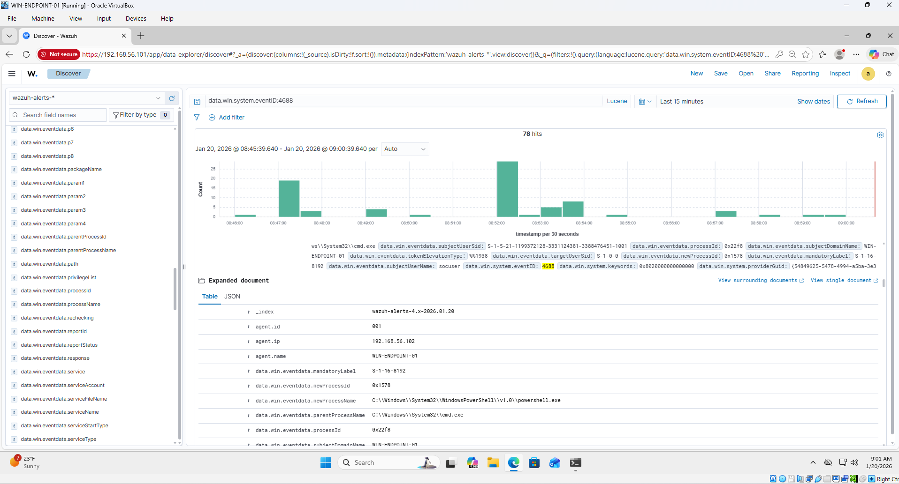

# SIEM Detection Lab — Wazuh


## Overview

This lab deploys a functional SIEM environment using **Wazuh** to monitor a Windows 11 endpoint, detect authentication anomalies, and correlate suspicious process execution behavior. The project focuses on the core analyst workflow: onboarding an endpoint, ingesting telemetry, correlating events, and mapping findings to MITRE ATT&CK.

**Key outcomes:**
- Windows 11 endpoint onboarded and actively monitored via Wazuh Agent
- Detected failed login attempts (brute-force pattern) followed by successful authentication
- Correlated PowerShell execution post-authentication with MITRE T1059.001
- Investigated using OpenSearch Dashboards with parent-child process analysis

---

## Architecture



**Network:** Host-only adapter for agent-to-manager communication; NAT for internet access.

---

## Data Sources

| Event ID | Description | Why It Matters |
|---|---|---|
| 4625 | Failed logon attempt | Detects brute-force / credential guessing |
| 4624 | Successful logon | Establishes authentication baseline |
| 4688 | Process creation | Detects post-auth execution (e.g., PowerShell) |

Advanced Audit Policy was enabled on the Windows endpoint to ensure high-fidelity security telemetry for all three event categories.

---

## Detection Scenario

**Scenario:** Suspicious Authentication Followed by PowerShell Execution

This use case mirrors a common attacker workflow: credential guessing → successful login → post-authentication reconnaissance or lateral movement.

**Detection logic:**

```
1. Multiple 4625 events (failed logons) within a short time window
        ↓
2. Single 4624 event (successful logon) on same host/user
        ↓
3. 4688 event (PowerShell process creation) shortly after authentication
        ↓
4. Review parent process, command-line args, and user context
```

**MITRE ATT&CK Mapping:**

| Technique | ID | Observed Behavior |
|---|---|---|
| Brute Force | T1110 | Repeated failed logon attempts |
| PowerShell | T1059.001 | PowerShell spawned post-authentication |

---

## Screenshots

**Agent connected and active in Wazuh:**



**Failed login attempts detected (Event ID 4625):**



**Successful logon event (Event ID 4624):**



**PowerShell execution detected (Event ID 4688):**



---

## Investigation Notes

Events were analyzed in OpenSearch Dashboards (Discover view). Process parent-child relationships, the user context, and privilege level were reviewed to determine the nature of the activity.

**Outcome:** Behavior confirmed as benign lab activity. Detection logic and investigation workflow reflect real-world SOC triage procedures.

---

## Key Concepts Demonstrated

| Area | What Was Built |
|---|---|
| SIEM Deployment | Wazuh All-in-One on Linux, agent-based endpoint monitoring |
| Endpoint Telemetry | Advanced Audit Policy, Windows Security Event Log |
| Threat Detection | Multi-event correlation across authentication and execution |
| MITRE ATT&CK | Mapped observed behavior to T1110 and T1059.001 |
| SIEM Investigation | OpenSearch Dashboards, process tree analysis, user context review |

---

## Tools & Technologies

`Wazuh SIEM` `OpenSearch Dashboards` `Windows 11` `Windows Security Event Log` `Advanced Audit Policy` `PowerShell` `MITRE ATT&CK` `VirtualBox` `Linux`

---

## Repository Structure

```
Siem-Detection-Lab-Wazuh/
├── docs/               # Lab notes and investigation documentation
├── queries/            # OpenSearch/Wazuh query references
├── screenshots/        # Evidence screenshots from the lab
└── README.md
```

---
